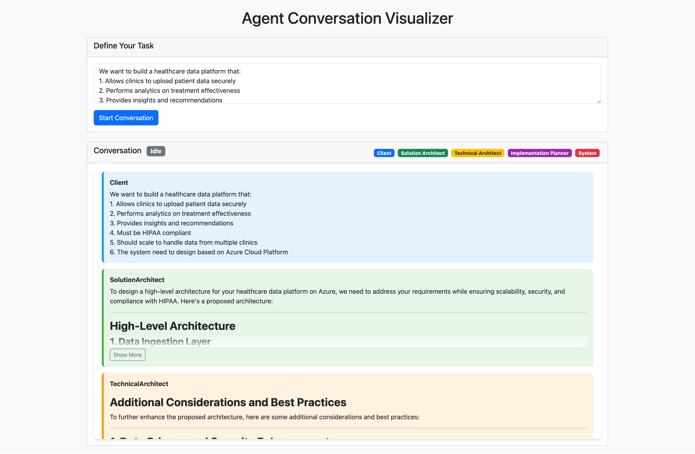

# 🚀 Project Overview

AutoGen 101 is a hands-on learning project for exploring the Microsoft AutoGen framework, which enables building collaborative AI agent systems. This repository contains tutorials, examples, and practices to help you understand and leverage multi-agent AI systems for real-world applications.

# ⚡ Quick Start

## Prerequisites

This project use Azure OpenAI as LLM provider. You need to have deployed a GPT model (e.g. GPT-4o) via [Azure AI Foundary](https://ai.azure.com/) and obtained the API key and endpoint. Detailed steps are as following:


## Dev Container

The quickest way to get started is to use the project devcontainer.

1. Clone the repository to your local machine.

2. Open the project in VSCode and let the Dev Container do the setup for you. Refer to the [VSCode Dev Containers](https://code.visualstudio.com/docs/devcontainers/containers) for more information.

3. Rename the `.env.example` file to `.env`. This file is used to store your Azure OpenAI API credentials as environment variables. Open the `.env` file and add your own credentials. It should look something like this.

   ```env
    AZURE_OPENAI_MODEL="gpt-4o"
    AZURE_OPENAI_API_KEY="<your-api-key>"
    AZURE_OPENAI_ENDPOINT="https://<your-resource-name>.openai.azure.com/"
    AZURE_OPENAI_API_VERSION="2024-12-01-preview"
   ```

## Local Setup

1. Clone the repository to your local machine.

2. Be sure to have `uv` installed. If you don't have it, you can install it by running `pip install uv` or refer to the [uv docs](https://docs.astral.sh/uv/getting-started/installation/) for other installation options.

3. Create a virtual environment and install the project dependencies by running `uv sync`.

4. Rename the `.env.example` file to `.env`. This file is used to store your Azure OpenAI API credentials as environment variables. Open the `.env` file and add your own credentials. It should look something like this:

   ```env
    AZURE_OPENAI_MODEL="gpt-4o"
    AZURE_OPENAI_API_KEY="<your-api-key>"
    AZURE_OPENAI_ENDPOINT="https://<your-resource-name>.openai.azure.com/"
    AZURE_OPENAI_API_VERSION="2024-12-01-preview"
   ```

# 🛠️ Project Structure

## Main Tutorial Notebook: [autogen_101.ipynb](autogen_101.ipynb)

- This is the main tutorial notebook with framework introduction, key concepts
- It also contains a lot of code examples to help you understand the framework
- By the end of the notebook, you will **build a full AI Startup Team with multiple agents** that can work together to solve a complex task

  

> **🤖 Note:** A significant portion of this notebook's content was autonomously generated by another multi-agent AI system. Check out [tutorial_lab_agent.py](Examples/tutorial_lab_agent.py) to see how it works!

## Practical Implementation Examples: [Examples/](Examples/)

- [data_analyst_agent.py](Examples/data_analyst_agent.py): Data analysis agent implementation. This is an example of single agent that can analyze data and provide visualizations.

- [tutorial_lab_agent.py](Examples/tutorial_lab_agent.py): Example of agents that create tutorial content. This is an example of a more complex multi-agent system.

  > **🤖 Note:** In fact, a lot of content in `autogen_101.ipynb` was autonomously generated by this multi-agent AI system.

- [architecture_design_agent](Examples/architecture_design_agent/): Architecture design system with multiple specialized agents. This is an example of a multi-agent team that can design an architecture for a given problem.

  

## Hands-on Practical Exercises: [Practices/](Practices/)

Each practice is a complete multi-agent system that can solve a specific problem. In the each practice folder, you can find a `code_template.py` file that contains the code template for the practice and a `README.md` file that contains the problem **Scenario** for the practice and **Your Tasks** for the practice. Here are the practices:

- [01-AI_Product_Brainstorm](Practices/01-AI_Product_Brainstorm/README.md)
- [02-Risk_Intelligence_Unit](Practices/02-Risk_Intelligence_Unit/README.md)
- [03-Legal_Contract_Analysis](Practices/03-Legal_Contract_Analysis/README.md)
